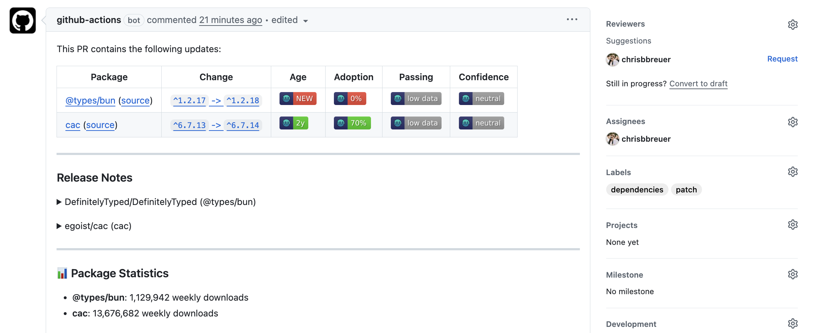

## Code Style Guidelines

**Scope:** All files matching `**/*.{ts,tsx}`

**Purpose:** Code Style & Structure specifics

### Code Style

- Write concise, functional code with proper types

  ```ts
  // Good
  function mergeConfigs<T>(base: T, override: Partial<T>): T {
    return { ...base, ...override }
  }

  // Avoid
  class ConfigMerger {
    merge(base: any, override: any) {
      return Object.assign({}, base, override)
    }
  }
  ```

- Use Bun native modules when available

  ```ts
  // Good
  import { file } from 'bun'

  // Avoid
  import { readFile } from 'node:fs/promises'
  const config = await file('config.json').json()
  const config = JSON.parse(await readFile('config.json', 'utf-8'))
  ```

- Use descriptive variable names with proper prefixes

  ```ts
  // Good
  const isConfigValid = validateConfig(config)
  const hasCustomOptions = Boolean(options.custom)
  const shouldUseDefaults = !configExists || isConfigEmpty

  // Avoid
  const valid = check(cfg)
  const custom = !!options.custom
  const defaults = !exists || empty
  ```

- Write proper JSDoc comments for public APIs

  ```ts
  /**
   * Loads configuration from a file or remote endpoint
   * @param options - Configuration options
   * @param options.name - Name of the config file
   * @param options.cwd - Working directory (default: process.cwd())
   * @returns Resolved configuration object
   * @throws {ConfigError} When config loading fails
   * @example
   * ```ts
   * const config = await loadConfig({
   *   name: 'myapp',
   *   defaultConfig: { port: 3000 }
   * })
   * ```
   */
  async function loadConfig<T>(options: Config<T>): Promise<T>
  ```

- Use proper module organization

  ```ts
  export { ConfigError } from './errors'
  // config.ts
  export { loadConfig } from './loader'
  export type { Config, ConfigOptions } from './types'
  ```

- Follow consistent error handling patterns

  ```ts
  // Good
  const result = await loadConfig(options).catch((error) => {
    console.error('Config loading failed:', error)
    return options.defaultConfig
  })

  // Avoid
  try {
    const result = await loadConfig(options)
  }
  catch (e) {
    console.log('Error:', e)
  }
  ```

- Use proper type assertions

  ```ts
  // Good
  const config = result as Config
  if (!isValidConfig(config))
    throw new Error('Invalid config')

  // Avoid
  const config = result as any
  ```

## Documentation Guidelines

**Scope:** All files matching `**/*.{ts,tsx,md}`

**Purpose:** Documentation specific rules

### API Documentation

- Document all public APIs thoroughly
- Include TypeScript type information
- Provide clear function signatures
- Document config options and defaults
- Include return type information
- Document async behavior

### Configuration Examples

- Provide basic usage examples
- Include complex configuration examples
- Document all supported config formats
- Show browser usage examples
- Include TypeScript configuration examples
- Document config merging behavior

### Type Documentation

- Document generic type parameters
- Explain type constraints
- Document interface properties
- Include type union explanations
- Document type generation features
- Provide type utility examples

### Error Documentation

- Document common error scenarios
- Include error handling examples
- Document error recovery options
- Explain validation errors
- Document browser-specific errors
- Include troubleshooting guides

### Code Examples

- Include runnable code examples
- Provide TypeScript examples
- Show error handling patterns
- Include browser environment examples
- Document testing approaches
- Include CLI usage examples

### Best Practices

- Keep documentation up to date
- Use consistent formatting
- Include inline code comments
- Document breaking changes
- Maintain a changelog
- Include version information

### File Structure

- Maintain clear docs organization
- Use proper markdown formatting
- Include table of contents
- Organize by topic
- Keep related docs together
- Use proper headings

### Documentation Standards

- Use clear and concise language
- Include proper code blocks
- Document all parameters
- Provide return value descriptions
- Include usage notes
- Document dependencies
- Keep examples current

## Error Handling Guidelines

**Scope:** All files matching `**/*.{ts,tsx}`

**Purpose:** Error Handling and Validation specifics

### Error Handling

- Use early returns and guard clauses for validation

  ```ts
  function loadConfig<T>(options: Config<T>) {
    if (!options.name)
      throw new Error('Config name is required')

    if (!isObject(options.defaultConfig))
      throw new Error('Default config must be an object')

    // Continue with valid input
  }
  ```

- Implement proper error types

  ```ts
  class ConfigError extends Error {
    constructor(
      message: string,
      public readonly code: string,
      public readonly details?: unknown
    ) {
      super(message)
      this.name = 'ConfigError'
    }
  }
  ```

- Use descriptive error messages

  ```ts
  throw new ConfigError(
    `Failed to load config file: ${filePath}`,
    'CONFIG_LOAD_ERROR',
    { cause: error }
  )
  ```

- Handle async errors properly

  ```ts
  async function loadConfigFile(path: string) {
    try {
      const content = await Bun.file(path).text()
      return JSON.parse(content)
    }
    catch (error) {
      if (error instanceof SyntaxError)
        throw new ConfigError('Invalid JSON in config file', 'PARSE_ERROR')
      throw new ConfigError('Failed to read config file', 'READ_ERROR')
    }
  }
  ```

- Implement proper error logging

  ```ts
  function handleError(error: unknown) {
    if (error instanceof ConfigError) {
      console.error(`[${error.code}] ${error.message}`)
      if (error.details)
        console.debug('Error details:', error.details)
    }
    else {
      console.error('Unexpected error:', error)
    }
  }
  ```

- Use error boundaries for unexpected errors

  ```ts
  try {
    await loadConfig(options)
  }
  catch (error) {
    handleError(error)
    return options.defaultConfig ?? {}
  }
  ```

- Ensure errors are typed when using Result types

  ```ts
  import { err, ok, Result } from 'neverthrow'

  function validateConfig(config: unknown): Result<Config, ConfigError> {
    if (!isValidConfig(config))
      return err(new ConfigError('Invalid config format', 'VALIDATION_ERROR'))
    return ok(config)
  }
  ```

## Key Conventions

**Scope:** All files matching `**/*.{ts,tsx}`

**Purpose:** Key Conventions specifics

### Conventions

- Prefer browser-compatible implementations when possible

  ```ts
  // Good - Browser compatible
  const config = await fetch('/api/config').then(r => r.json())

  // Avoid - Node.js specific
  const config = require('./config')
  ```

- Aim for comprehensive test coverage

  ```ts
  // Test both success and failure cases
  describe('loadConfig', () => {
    it('success case - load config', async () => {})
    it('failure case - handle errors', async () => {})
    it('edge case - malformed config', async () => {})
  })
  ```

- Use proper TypeScript types instead of `any`

  ```ts
  // Good
  function loadConfig<T extends Record<string, unknown>>(options: Config<T>): Promise<T>

  // Avoid
  function loadConfig(options: any): Promise<any>
  ```

- Use consistent error handling and logging

  ```ts
  // Good
  console.error('Failed to load config:', error)
  return options.defaultConfig

  // Avoid
  console.log('Error:', e)
  throw e
  ```

- Follow file naming conventions

  ```text
  config.ts           // Core functionality
  config.test.ts      // Test files
  config.types.ts     // Type definitions
  .{name}.config.ts   // Config files
  ```

- Use proper exports and imports

  ```ts
  // Good
  export { loadConfig } from './loader'
  export type { Config } from './types'

  // Avoid
  export default {
    loadConfig,
    Config,
  }
  ```

- Maintain consistent directory structure

  ```text
  src/           // Source code
  ├─ index.ts    // Main exports
  ├─ types.ts    // Type definitions
  ├─ config.ts   // Configuration
  ├─ merge.ts    // Deep merge
  └─ utils/      // Utilities
  ```

- Follow ESLint rules and maintain consistent style

  ```ts
  // Good - Follow ESLint config
  const config = {
    name: 'app',
    port: 3000,
  }

  // Avoid - Inconsistent style
  const config = { name: 'app', port: 3000 }
  ```

### Project Structure

**Scope:** All files matching `**/*`

**Purpose:** Project Structure specifics

### Root Directory

```text
├─ package.json        # Package configuration
├─ tsconfig.json       # TypeScript configuration
├─ eslint.config.ts    # ESLint configuration
├─ bunfig.toml        # Bun configuration
├─ README.md          # Project documentation
├─ CHANGELOG.md       # Version history
└─ LICENSE.md         # License information
```

### Source Code

```text
src/
├─ index.ts           # Main entry point
├─ types.ts           # Type definitions
├─ config.ts          # Configuration loading
├─ merge.ts           # Deep merge implementation
├─ utils/             # Utility functions
└─ generated/         # Generated type files
```

### Test Files

```text
test/
├─ bunfig.test.ts     # Main test suite
├─ cli.test.ts        # CLI tests
├─ tmp/               # Temporary test files
│  ├─ config/         # Test config files
│  └─ generated/      # Test generated files
└─ fixtures/          # Test fixtures
```

### Documentation

```text
docs/
├─ intro.md           # Introduction guide
├─ usage.md           # Usage documentation
├─ api/               # API documentation
├─ .vitepress/        # VitePress configuration
└─ public/            # Static assets
```

### Development

```text
.vscode/             # VS Code configuration
.github/             # GitHub configuration
├─ workflows/        # CI/CD workflows
└─ FUNDING.yml       # Funding information
.cursor/             # Cursor IDE configuration
└─ rules/           # Project rules
```

### Build Output

```text
dist/
├─ index.js          # Main bundle
├─ index.d.ts        # Type definitions
└─ cli.js           # CLI bundle
```

### Structure Conventions

- Keep related files together
- Use consistent file naming
- Follow module organization patterns
- Maintain clear separation of concerns
- Document directory purposes
- Keep directory structure flat when possible

## Syntax & Formatting Guidelines

- Use consistent indentation (2 spaces)

  ```ts
  // Good
  function loadConfig<T>(options: Config<T>) {
    if (!options.name)
      throw new Error('Config name is required')

    return options.defaultConfig
  }

  // Avoid
  function loadConfig<T>(options: Config<T>) {
    if (!options.name)
      throw new Error('Config name is required')

    return options.defaultConfig
  }
  ```

- Use concise syntax for simple conditionals

  ```ts
  // Good
  if (!options.name)
    throw new Error('Config name is required')

  // Avoid
  if (!options.name) {
    throw new Error('Config name is required')
  }
  ```

- Format function declarations consistently

  ```ts
  // Good
  async function loadConfig<T>(
    options: Config<T>,
    context?: Context
  ): Promise<T> {
    // Implementation
  }

  // Avoid
  async function loadConfig<T>(options: Config<T>, context?: Context): Promise<T> {
    // Implementation
  }
  ```

- Format type definitions clearly

  ```ts
  // Good
  interface Config<T = Record<string, any>> {
    name: string
    cwd?: string
    defaultConfig?: T
    endpoint?: string
  }

  // Avoid
  interface Config<T = Record<string, any>> { name: string, cwd?: string, defaultConfig?: T, endpoint?: string }
  ```

- Use proper spacing in object literals

  ```ts
  // Good
  const config = {
    name: 'app',
    options: {
      port: 3000,
      host: 'localhost',
    },
  }

  // Avoid
  const config = { name: 'app', options: { port: 3000, host: 'localhost' } }
  ```

- Format imports consistently

  ```text
  // Good
  import { describe, expect, it } from 'bun:test'
  // Avoid
  import { describe, expect, it } from 'bun:test'
  import { existsSync, readFileSync } from 'node:fs'

  import { resolve } from 'node:path'
  ```

- Use proper JSDoc formatting

  ```ts
  // Good
  /**
   * Loads configuration from a file
   * @param options - Configuration options
   * @returns Resolved configuration
   */
  function loadConfig(options: Config): Promise<unknown>

  // Avoid
  /**
   * Loads configuration from a file
   * @param options Configuration options
   * @returns Resolved configuration
   */
  function loadConfig(options: Config): Promise<unknown>
  ```

- Format test cases consistently

  ```ts
  // Good
  describe('loadConfig', () => {
    it('should load default config', async () => {
      const result = await loadConfig(options)
      expect(result).toEqual(expected)
    })
  })

  // Avoid
  describe('loadConfig', () => {
    it('should load default config', async () => {
      const result = await loadConfig(options)
      expect(result).toEqual(expected)
    })
  })
  ```

## Testing Guidelines

- Write tests for all public APIs and utilities

  ```ts
  describe('loadConfig', () => {
    it('should load default config when no file exists', async () => {
      const result = await loadConfig({
        name: 'test',
        defaultConfig: { port: 3000 }
      })
      expect(result).toEqual({ port: 3000 })
    })
  })
  ```

- Use proper test organization with describe blocks

  ```ts
  describe('bunfig', () => {
    describe('loadConfig', () => {
      // Config loading tests
    })

    describe('deepMerge', () => {
      // Merge function tests
    })
  })
  ```

- Test edge cases and error scenarios

  ```ts
  it('should handle malformed config files', async () => {
    const result = await loadConfig({
      name: 'invalid',
      defaultConfig: { fallback: true }
    })
    expect(result).toEqual({ fallback: true })
  })
  ```

- Use proper cleanup in tests

  ```ts
  beforeEach(() => {
    // Setup test environment
    if (existsSync(testConfigDir))
      rmSync(testConfigDir, { recursive: true })
    mkdirSync(testConfigDir, { recursive: true })
  })

  afterEach(() => {
    // Cleanup test files
    if (existsSync(testConfigDir))
      rmSync(testConfigDir, { recursive: true })
  })
  ```

- Use Bun's native test modules

  ```ts
  import { describe, expect, it, mock } from 'bun:test'
  ```

- Mock external dependencies properly

  ```ts
  const mockFetch = mock(() =>
    Promise.resolve({
      ok: true,
      json: () => Promise.resolve({ config: 'value' })
    })
  )
  globalThis.fetch = mockFetch
  ```

- Test both success and failure paths

  ```ts
  it('should handle network errors', async () => {
    mockFetch.mockImplementation(() =>
      Promise.reject(new Error('Network error'))
    )
    // Test error handling
  })
  ```

  ## TypeScript Usage

- Use interfaces for configuration objects and public APIs

  ```ts
  // Good
  interface Config<T = Record<string, any>> {
    name: string
    cwd?: string
    defaultConfig?: T
    endpoint?: string
  }

  // Avoid
  interface Config {
    name: string
    // ...
  }
  ```

- Use `as const` for fixed values instead of enums

  ```ts
  // Good
  const CONFIG_EXTENSIONS = ['.ts', '.js', '.mjs', '.cjs', '.json'] as const

  // Avoid
  enum ConfigExtensions {
    TS = '.ts',
    JS = '.js'
  }
  ```

- Use proper generic constraints for type safety

  ```ts
  // Good
  function loadConfig<T extends Record<string, unknown>>(options: Config<T>): Promise<T>

  // Avoid
  function loadConfig<T>(options: Config<T>): Promise<T>
  ```

- Implement strict type checking for config merging

  ```ts
  // Good
  function deepMerge<T extends Record<string, any>>(target: T, source: Partial<T>): T

  // Avoid
  function deepMerge(target: any, source: any): any
  ```

- Use type guards for runtime type checking

  ```ts
  // Good
  function isObject(value: unknown): value is Record<string, unknown> {
    return typeof value === 'object' && value !== null
  }
  ```

- Export types explicitly for public APIs

  ```ts
  // Good
  export type { Config, ConfigOptions }
  export interface DeepMergeOptions {
    // ...
  }
  ```

## buddy-bot Documentation

**Scope:** General information based on the latest ./README.md content

**Purpose:** Documentation for the buddy-bot package

> The fastest, most intelligent dependency management bot for modern JavaScript and TypeScript projects _(and PHP)_.

Buddy Bot is a lightning-fast alternative to Dependabot and Renovate, purpose-built for modern JavaScript, TypeScript, and PHP ecosystems. It intelligently scans your projects, detects outdated & deprecated dependencies across multiple package managers, and creates beautifully formatted pull requests with comprehensive changelogs and metadata.



## Features

### 🚀 **Performance & Speed**

- **Lightning Fast Execution**: _Built with Bun for maximum performance_
- **Intelligent Scanning**: _Uses `bun outdated` and GitHub releases API for accurate, real-time dependency detection_
- **Optimized CI/CD**: _Minimal resource usage with smart caching_

### 📦 **Universal Package Support**

- **Multi-Package Manager**: _Full support for Bun, npm, yarn, pnpm, Composer, pkgx & Launchpad_
- **GitHub Actions**: _Automatically updates workflow dependencies (`actions/checkout@v4`, etc.)_
- **Docker Images**: _Detects and updates Dockerfile base images and versions_
- **Lock File Awareness**: _Respects and updates all lock file formats_

### 🎯 **Smart Dependency Management**

- **Configurable Update Strategies**: _Choose from major, minor, patch, or all updates_
- **Flexible Package Grouping**: _Group related packages for cleaner, focused PRs_
- **Intelligent Conflict Detection**: _Prevents breaking changes with smart dependency analysis_
- **Security-First Updates**: _Prioritizes security patches and vulnerability fixes_

### 📊 **Rich Dashboard & Monitoring**

- **Dependency Dashboard**: _Centralized GitHub issue with complete dependency overview_
- **Interactive Rebase**: _One-click PR updates via checkbox interface_
- **Real-time Status Tracking**: _Live monitoring of all open PRs and pending updates_
- **Comprehensive Reporting**: _Detailed update summaries with confidence metrics_

### 🎨 **Beautiful Pull Requests**

- **Multi-Format Tables**: _Separate sections for npm, PHP/Composer, pkgx/Launchpad, and GitHub Actions_
- **Rich Metadata**: _Confidence badges, adoption metrics, age indicators, and download stats_
- **Detailed Changelogs**: _Automatic release notes and breaking change detection_
- **Professional Formatting**: _Clean, readable PR descriptions with proper categorization_

### ⚙️ **Developer Experience**

- **Zero Configuration**: _Works immediately with intelligent defaults_
- **Interactive Setup**: _Renovate-like guided configuration with validation_
- **Migration Tools**: _Seamless import from existing Renovate and Dependabot setups_
- **TypeScript Config**: _Full type safety with `buddy-bot.config.ts`_

### 🔌 **Extensible Integration**

- **Plugin Ecosystem**: _Built-in Slack, Discord, and Jira integrations_
- **Custom Hooks**: _Extensible system for organization-specific workflows_
- **CI/CD Ready**: _Pre-built GitHub Actions workflows for all use cases_
- **API Access**: _Programmatic control for advanced automation_

## Quick Start

```bash
# Install globally
bun add -g buddy-bot

# Interactive setup (recommended)
buddy-bot setup

# Non-interactive setup for CI/CD
buddy-bot setup --non-interactive

# Non-interactive with specific preset
buddy-bot setup --non-interactive --preset testing --verbose

# Or run directly for scanning only
buddy-bot scan
```

## Usage

### Interactive Setup

The easiest way to get started is with the interactive setup command:

```bash
buddy-bot setup
```

This comprehensive setup wizard will guide you through configuring automated dependency updates for your project in a Renovate-like experience.

### Non-Interactive Setup

For CI/CD pipelines and automated deployments, use the non-interactive mode:

```bash
# Basic non-interactive setup (uses defaults)
buddy-bot setup --non-interactive

# Specify preset and token setup
buddy-bot setup --non-interactive --preset testing --token-setup existing-secret --verbose

# Production setup with security focus
buddy-bot setup --non-interactive --preset security --token-setup existing-secret
```

**Available options:**

- `--non-interactive` - Skip all prompts, use defaults
- `--preset <type>` - Workflow preset: `standard`, `high-frequency`, `security`, `minimal`, `testing` (default: `standard`)
- `--token-setup <type>` - Token mode: `default-token`, `existing-secret`, `new-pat` (default: `default-token`)

The setup process includes:

**🔍 Pre-flight Validation**

- **Environment checks** - Validates git repository, Node.js/Bun installation
- **Conflict detection** - Scans for existing dependency management tools (Renovate, Dependabot)
- **Git configuration** - Ensures proper git user setup
- **GitHub CLI detection** - Suggests helpful tools for authentication

**📊 Smart Project Analysis**

- **Project type detection** - Identifies library, application, monorepo, or unknown projects
- **Package manager detection** - Detects Bun, npm, yarn, pnpm with lock file validation
- **Dependency ecosystem analysis** - Finds pkgx, Launchpad dependency files
- **GitHub Actions discovery** - Scans existing workflows for updates
- **Intelligent recommendations** - Suggests optimal setup based on project characteristics

**📈 Interactive Progress Tracking**

- **Visual progress bar** - Real-time completion percentage with progress indicators
- **Step-by-step guidance** - Clear indication of current and completed steps
- **Time tracking** - Setup duration monitoring
- **Recovery capabilities** - Resume from failures with detailed error reporting

**📋 Step 1: Configuration Migration & Discovery**

- **Tool Detection** - Automatically detects existing Renovate and Dependabot configurations
- **Seamless Migration** - Imports settings, schedules, package rules, and ignore patterns
- **Compatibility Analysis** - Identifies incompatible features and provides alternatives
- **Migration Report** - Detailed summary of migrated settings and confidence levels

**🔌 Step 2: Integration Discovery**

- **Plugin Discovery** - Automatically detects available integrations (Slack, Discord, Jira)
- **Environment Detection** - Scans for webhook URLs, API tokens, and configuration files
- **Plugin Loading** - Enables discovered integrations for setup completion notifications
- **Custom Plugins** - Supports custom plugin definitions in `.buddy/plugins/` directory

**🔍 Step 3: Repository Detection & Validation**

- Automatically detects your GitHub repository from git remote
- **API validation** - Tests repository access and permissions via GitHub API
- **Repository health checks** - Validates issues, permissions, and settings
- **Private repository support** - Enhanced validation for private repositories

**🔑 Step 4: Enhanced Token Setup**

- Guides you through creating a Personal Access Token (PAT)
- **Scope validation** - Explains required scopes (`repo`, `workflow`) with examples
- **Token testing** - Validates token permissions before proceeding
- Helps set up repository secrets for enhanced features

**🔧 Step 5: Repository Settings Validation**

- Walks you through GitHub Actions permissions configuration
- **Permission verification** - Tests workflow permissions in real-time
- **Organization settings** - Guidance for organization-level permissions
- Ensures proper workflow permissions for PR creation

**⚙️ Step 6: Intelligent Workflow Configuration**
Choose from several carefully crafted presets with smart recommendations:

- **Standard Setup (Recommended)** - Dashboard updates 3x/week, balanced dependency updates
- **High Frequency** - Check for updates multiple times per day
- **Security Focused** - Frequent patch updates with security-first approach
- **Minimal Updates** - Weekly checks, lower frequency
- **Development/Testing** - Manual triggers + frequent checks for testing
- **Custom Configuration** - Advanced schedule builder with cron preview

**📝 Step 7: Enhanced Configuration Generation**

- Creates `buddy-bot.config.json` with repository-specific settings
- **Project-aware defaults** - Configuration optimized for detected project type
- **Ecosystem integration** - Includes detected package managers and dependency files
- Includes sensible defaults and customization options

**🔄 Step 8: Workflow Generation & Validation**

- Generates three core GitHub Actions workflows:
  - `buddy-dashboard.yml` - Dependency Dashboard Management
  - `buddy-check.yml` - Auto-rebase PR checker
  - `buddy-update.yml` - Scheduled dependency updates
- **YAML validation** - Ensures generated workflows are syntactically correct
- **Security best practices** - Validates token usage and permissions
- **Workflow testing** - Verifies generated workflows meet requirements

**🎯 Step 9: Comprehensive Validation & Instructions**

- **Setup verification** - Validates all generated files and configurations
- **Workflow testing** - Tests generated workflow syntax and requirements
- **Clear next steps** - Git commands and repository setup instructions
- **Documentation links** - Direct links to GitHub settings pages
- **Troubleshooting guide** - Common issues and solutions

**🔌 Step 10: Integration Notifications**

- **Plugin Execution** - Executes loaded integration hooks for setup completion
- **Slack Notifications** - Rich setup completion messages with repository details
- **Discord Embeds** - Colorful setup completion notifications with project information
- **Jira Tickets** - Automatic task creation for tracking setup completion
- **Custom Hooks** - Extensible system for organization-specific integrations

### Command Line Interface

```bash
# Setup commands
buddy setup                                    # Interactive setup (recommended)
buddy setup --non-interactive                 # Non-interactive with defaults
buddy setup --non-interactive --preset testing --verbose

# Scan for dependency updates
buddy scan
buddy scan --verbose

# Check specific packages
buddy scan --packages "react,typescript,@types/node"

# Check packages with glob patterns
buddy scan --pattern "@types/*"

# Apply different update strategies
buddy scan --strategy minor
buddy scan --strategy patch

# Update dependencies and create PRs
buddy update --dry-run
buddy update

# Check for rebase requests and update PRs
buddy update-check
buddy update-check --dry-run
buddy update-check --verbose

# Get help
buddy help
```

### Configuration

Create a `buddy-bot.config.ts` file in your project root:

```typescript
import type { BuddyBotConfig } from 'buddy-bot'

const config: BuddyBotConfig = {
  verbose: false,

  // Repository settings for PR creation
  repository: {
    provider: 'github',
    owner: 'your-org',
    name: 'your-repo',
    token: process.env.GITHUB_TOKEN,
    baseBranch: 'main'
  },

  // Package update configuration
  packages: {
    strategy: 'all', // 'major' | 'minor' | 'patch' | 'all'
    ignore: [
      'legacy-package',
      '@types/node' // Example ignores
    ],
    groups: [
      {
        name: 'TypeScript Types',
        patterns: ['@types/*'],
        strategy: 'minor'
      },
      {
        name: 'ESLint Ecosystem',
        patterns: ['eslint*', '@typescript-eslint/*'],
        strategy: 'patch'
      }
    ]
  },

  // Pull request settings
  pullRequest: {
    titleFormat: 'chore(deps): {title}',
    commitMessageFormat: 'chore(deps): {message}',
    reviewers: ['maintainer1', 'maintainer2'],
    labels: ['dependencies', 'automated'],
    autoMerge: {
      enabled: true,
      strategy: 'squash', // 'merge', 'squash', or 'rebase'
      conditions: ['patch-only'] // Only auto-merge patch updates
    }
  },

  // Dependency dashboard settings
  dashboard: {
    enabled: true,
    title: 'Dependency Dashboard',
    pin: true,
    labels: ['dependencies', 'dashboard'],
    assignees: ['maintainer1'],
    showOpenPRs: true,
    showDetectedDependencies: true
  }
}

export default config
```

## Configuration Migration

Buddy Bot can automatically migrate your existing dependency management configurations from Renovate and Dependabot, making the transition seamless.

### Supported Migration Sources

- **Renovate** - `renovate.json`, `.renovaterc`, package.json renovate config
- **Dependabot** - `.github/dependabot.yml`, `.github/dependabot.yaml`

### Migration Process

1. **Automatic Detection** - Scans for existing configuration files
2. **Smart Conversion** - Maps settings to Buddy Bot equivalents
3. **Compatibility Check** - Identifies unsupported features
4. **Migration Report** - Provides detailed conversion summary

```bash
# Migration happens automatically during setup
buddy-bot setup

# Or use programmatically
import { ConfigurationMigrator } from 'buddy-bot/setup'

const migrator = new ConfigurationMigrator()
const tools = await migrator.detectExistingTools()
const result = await migrator.migrateFromRenovate('renovate.json')
```

### Migrated Settings

| Renovate | Dependabot | Buddy Bot | Notes |
|----------|------------|-----------|-------|
| `schedule` | `schedule.interval` | Workflow presets | Mapped to Standard/High-Frequency/Minimal |
| `packageRules` | `ignore` | Package groups & ignore lists | Preserves grouping logic |
| `automerge` | N/A | Auto-merge settings | Includes strategy preferences |
| `assignees`/`reviewers` | N/A | PR configuration | Maintains team assignments |

## Integration Ecosystem

Buddy Bot includes an extensible plugin system that enables integrations with popular collaboration and project management tools.

### Built-in Integrations

#### Slack Integration

```bash
# Set environment variable
export SLACK_WEBHOOK_URL="https://hooks.slack.com/services/YOUR/SLACK/WEBHOOK"

# Or create config file
echo "https://hooks.slack.com/services/YOUR/SLACK/WEBHOOK" > .buddy/slack-webhook
```

**Features:**

- Rich setup completion notifications
- Repository and project details
- Error notifications for setup failures
- Configurable channel and username

#### Discord Integration

```bash
# Set environment variable
export DISCORD_WEBHOOK_URL="https://discord.com/api/webhooks/YOUR/DISCORD/WEBHOOK"

# Or create config file
echo "https://discord.com/api/webhooks/YOUR/DISCORD/WEBHOOK" > .buddy/discord-webhook
```

**Features:**

- Colorful embed notifications
- Project type and package manager details
- Timestamp tracking
- Setup completion confirmations

#### Jira Integration

```bash
# Set environment variables
export JIRA_API_TOKEN="your-jira-api-token"
export JIRA_BASE_URL="https://your-org.atlassian.net"
export JIRA_PROJECT_KEY="BUDDY"  # Optional, defaults to BUDDY
```

**Features:**

- Automatic ticket creation for setup completion
- Repository and project context
- Configurable project keys
- Setup tracking and documentation

### Custom Plugins

Create custom integrations by defining plugins in `.buddy/plugins/`:

```jsonc
// .buddy/plugins/custom-integration.json
{
  "name": "custom-integration",
  "version": "1.0.0",
  "enabled": true,
  "triggers": [
    { "event": "setup_complete" },
    { "event": "validation_error" }
  ],
  "hooks": [
    {
      "name": "custom-notification",
      "priority": 10,
      "async": true,
      "handler": "// Custom JavaScript function"
    }
  ],
  "configuration": {
    "webhook_url": "https://your-custom-webhook.com/notify",
    "api_key": "your-api-key"
  }
}
```

### Plugin Events

| Event | Description | Context |
|-------|-------------|---------|
| `pre_setup` | Before setup begins | Initial configuration |
| `post_setup` | After setup completes | Full setup context |
| `step_complete` | After each setup step | Step-specific progress |
| `validation_error` | When validation fails | Error details and recovery |
| `setup_complete` | Final setup completion | Complete project context |

### Programmatic Usage

```typescript
import { Buddy, ConfigManager } from 'buddy-bot'

// Load configuration
const config = await ConfigManager.loadConfig()

// Create Buddy instance
const buddy = new Buddy(config)

// Scan for updates
const scanResult = await buddy.scanForUpdates()

console.log(`Found ${scanResult.updates.length} updates`)

// Check specific packages
const updates = await buddy.checkPackages(['react', 'typescript'])

// Create pull requests
if (scanResult.updates.length > 0) {
  await buddy.createPullRequests(scanResult)
}

// Create or update dependency dashboard
const dashboardIssue = await buddy.createOrUpdateDashboard()
console.log(`Dashboard updated: ${dashboardIssue.url}`)
```

## Dependency Dashboard

The dependency dashboard provides a centralized view of all your repository's dependencies and open pull requests in a single GitHub issue. Similar to Renovate's dependency dashboard, it gives you complete visibility into your dependency management.

### Key Features

- **📊 Single Overview**: All dependencies and PRs in one place
- **🔄 Interactive Controls**: Force retry/rebase PRs by checking boxes
- **📌 Pinnable Issue**: Keep dashboard at the top of your issues
- **🏷️ Smart Categorization**: Organized by npm, GitHub Actions, and dependency files
- **⚡ Auto-Updates**: Refreshes when dependencies change

## Rebase Functionality

Buddy Bot includes powerful rebase functionality that allows you to update existing pull requests with the latest dependency versions, similar to Renovate's rebase feature.

### How It Works

All Buddy Bot pull requests include a rebase checkbox at the bottom:

```markdown
---
 - [ ] <!-- rebase-check -->If you want to update/retry this PR, check this box
---
```

### Using the Rebase Feature

1. **Check the box**: In any Buddy Bot PR, check the rebase checkbox
2. **Automatic detection**: The rebase workflow runs every minute to detect checked boxes
3. **Updates applied**: The PR is automatically updated with the latest dependency versions
4. **Checkbox unchecked**: After successful rebase, the checkbox is automatically unchecked

### Rebase Command

You can also trigger rebase manually using the CLI:

```bash
# Check for PRs with rebase checkbox enabled and update them
buddy-bot update-check

# Dry run to see what would be rebased
buddy-bot update-check --dry-run

# With verbose output
buddy-bot update-check --verbose
```

### Automated Rebase Workflow

Buddy Bot includes a pre-built GitHub Actions workflow (`.github/workflows/buddy-check.yml`) that:

- **🕐 Runs every minute**: Automatically checks for rebase requests
- **🔍 Scans all PRs**: Finds Buddy Bot PRs with checked rebase boxes
- **📦 Updates dependencies**: Re-scans for latest versions and updates files
- **📝 Updates PR content**: Refreshes PR title, body, and file changes
- **✅ Maintains workflow files**: Updates GitHub Actions workflows (requires proper permissions)

### Workflow File Permissions

For the rebase functionality to update GitHub Actions workflow files, you need proper permissions:

#### Option 1: Personal Access Token (Recommended)

1. Create a [Personal Access Token](https://github.com/settings/tokens) with `repo` and `workflow` scopes
2. Add it as a repository secret named `BUDDY_BOT_TOKEN`
3. The workflow automatically uses it when available

#### Option 2: Default GitHub Token (Limited)

- Uses `GITHUB_TOKEN` with limited permissions
- Cannot update workflow files (`.github/workflows/*.yml`)
- Still updates package.json, lock files, and dependency files

### What Gets Updated During Rebase

- ✅ **package.json** - npm/yarn/pnpm dependencies
- ✅ **Lock files** - package-lock.json, yarn.lock, pnpm-lock.yaml, bun.lockb
- ✅ **Dependency files** - deps.yaml, dependencies.yaml, pkgx.yaml
- ✅ **GitHub Actions** - workflow files (with proper permissions)
- ✅ **PR content** - Updated title, body, and metadata

### Quick Start

```bash
# Create basic dashboard
buddy-bot dashboard

# Create dashboard with custom title
buddy-bot dashboard --title "My Dependencies"
```

### Automated Dashboard Updates

Buddy Bot includes a pre-built GitHub workflow (`.github/workflows/buddy-dashboard.yml`) that automatically updates your dependency dashboard:

- **📅 Scheduled**: Runs Monday, Wednesday, Friday at 9 AM UTC
- **🖱️ Manual**: Trigger from Actions tab with custom options
- **📌 Auto-Pin**: Keeps dashboard pinned by default
- **🔍 Dry-Run**: Preview mode available

### Example Dashboard Output

The dashboard automatically organizes your dependencies and shows:

```markdown
## Open

The following updates have all been created. To force a retry/rebase of any, click on a checkbox below.

 - [ ] <!-- rebase-branch=buddy-bot/update-react-18 -->[chore(deps): update react to v18](../pull/123) (`react`)
 - [ ] <!-- rebase-branch=buddy-bot/update-types -->[chore(deps): update @types/node](../pull/124) (`@types/node`)

## Detected dependencies

<details><summary>npm</summary>
<blockquote>

<details><summary>package.json</summary>

 - `react ^17.0.0`
 - `typescript ^4.9.0`
 - `@types/node ^18.0.0`

</details>
</blockquote>
</details>

<details><summary>github-actions</summary>
<blockquote>

<details><summary>.github/workflows/ci.yml</summary>

 - `actions/checkout v3`
 - `oven-sh/setup-bun v1`

</details>
</blockquote>
</details>
```

## How It Works

Buddy Bot's intelligent workflow delivers unmatched speed and accuracy:

1. **⚡ Lightning-Fast Scanning**: Leverages `bun outdated` and parallel API calls for instant dependency analysis
2. **🔍 Universal Detection**: Automatically discovers and parses all dependency files across your entire project
3. **🧠 Smart Analysis**: Evaluates security implications, breaking changes, and compatibility before suggesting updates
4. **🎯 Intelligent Grouping**: Automatically clusters related packages to create focused, logical pull requests
5. **📊 Rich Context**: Fetches comprehensive metadata including adoption rates, confidence scores, and detailed changelogs
6. **✨ Professional PRs**: Generates beautifully formatted pull requests with actionable insights and clear upgrade paths

### Supported Dependency Files

Buddy automatically detects and updates the following dependency file formats:

#### Package Dependencies

- **package.json** - Traditional npm dependencies
- **composer.json** - PHP dependencies from Packagist
- **composer.lock** - PHP lock file with exact versions
- **deps.yaml** / **deps.yml** - Launchpad/pkgx dependency declarations
- **dependencies.yaml** / **dependencies.yml** - Alternative dependency file format
- **pkgx.yaml** / **pkgx.yml** - pkgx-specific dependency files
- **.deps.yaml** / **.deps.yml** - Hidden dependency configuration files

#### GitHub Actions

- **.github/workflows/*.yml** - GitHub Actions workflow files
- **.github/workflows/*.yaml** - Alternative YAML extension

All dependency files are parsed using the `ts-pkgx` library to ensure compatibility with the pkgx registry ecosystem while maintaining support for tools like Launchpad that reuse the same registry format. GitHub Actions are detected by parsing `uses:` statements in workflow files and checking for updates via the GitHub releases API.

### Pull Request Format

Buddy generates comprehensive pull requests with **three separate dependency tables**:

#### 1. npm Dependencies

Full table with confidence badges, age, adoption metrics, and weekly download statistics:

```
| Package | Change | Age | Adoption | Passing | Confidence |
|---------|--------|-----|----------|---------|------------|
| lodash  | ^4.17.20 → ^4.17.21 | 📅 | 📈 | ✅ | 🔒 |
```

#### 2. PHP/Composer Dependencies

Focused table for PHP packages from Packagist:

```
| Package | Change | File | Status |
|---------|--------|------|--------|
| laravel/framework | ^10.0.0 → ^10.16.0 | composer.json | ✅ Available |
| phpunit/phpunit | ^10.0.0 → ^10.3.0 | composer.json | ✅ Available |
```

#### 3. Launchpad/pkgx Dependencies

Simplified table focusing on package updates and file locations:

```
| Package | Change | File | Status |
|---------|--------|------|--------|
| bun.com | ^1.2.16 → ^1.2.19 | deps.yaml | ✅ Available |
```

#### 4. GitHub Actions

Workflow automation updates with direct links to repositories:

```
| Action | Change | File | Status |
|--------|--------|------|--------|
| actions/checkout | v4 → v4.2.2 | ci.yml | ✅ Available |
| oven-sh/setup-bun | v2 → v2.0.2 | release.yml | ✅ Available |
```

Each table is followed by detailed release notes, changelogs, and package statistics tailored to the dependency type.

## Update Strategies

- **`all`**: Update all dependencies regardless of semver impact
- **`major`**: Only major version updates
- **`minor`**: Major and minor updates (no patch-only)
- **`patch`**: All updates (major, minor, and patch)

## Auto-Merge Configuration

Buddy supports configurable auto-merge for pull requests to reduce manual overhead:

```typescript
const config: BuddyBotConfig = {
  pullRequest: {
    autoMerge: {
      enabled: true,
      strategy: 'squash', // 'merge', 'squash', or 'rebase'
      conditions: ['patch-only'] // Optional: restrict to specific update types
    }
  }
}
```

### Auto-Merge Strategies

- **`squash`**: Squash commits and merge _(recommended for clean history)_
- **`merge`**: Create a merge commit _(preserves individual commits)_
- **`rebase`**: Rebase and merge _(linear history without merge commits)_

### Auto-Merge Conditions

- **`patch-only`**: Only auto-merge patch version updates _(safest)_
- **No conditions**: Auto-merge all updates _(use with caution)_

### Workflow-Specific Auto-Merge

Each preset configures auto-merge appropriately:

- **High Frequency Updates**: Auto-merge patch updates only _(6AM, 12PM, 6PM)_, manual review for minor updates _(12AM)_
- **Security Focused**: Auto-merge security patches every 6 hours
- **Standard Project**: Auto-merge daily patches, manual review for weekly/monthly updates
- **Development/Testing**: No auto-merge, dry-run by default, enhanced testing features.

## Development & Testing

The **Development/Testing** preset is specifically designed for testing and development environments:

### Features

- **⏰ Every 5 minutes**: Automated runs for rapid testing cycles
- **🖱️ Manual triggers**: Full control via GitHub Actions UI
- **🔍 Dry run by default**: Safe testing without making changes
- **📝 Verbose logging**: Detailed output for debugging
- **📦 Package-specific testing**: Test updates for specific packages
- **📊 Enhanced summaries**: Detailed test reports with context

### Manual Trigger Options

When running manually, you can customize:

- **Update strategy**: Choose patch, minor, major, or all updates
- **Dry run mode**: Preview changes without applying them
- **Specific packages**: Test updates for particular packages only
- **Verbose logging**: Control output detail level

### Perfect For

- 🧪 Testing new configurations
- 🔧 Debugging dependency issues
- 📈 Monitoring update frequency
- 🚀 Validating workflow changes
- 📋 Learning how Buddy Bot works

## Package Grouping

Group related packages to create cleaner, more focused pull requests:

```typescript
{
  groups: [
    {
      name: 'React Ecosystem',
      patterns: ['react*', '@types/react*'],
      strategy: 'minor'
    },
    {
      name: 'Development Tools',
      patterns: ['eslint*', 'prettier*', '@typescript-eslint/*'],
      strategy: 'patch'
    }
  ]
}
```

## Example Output

When Buddy finds updates, it creates PRs like:

```
chore(deps): update all non-major dependencies

This PR contains the following updates:

| Package | Change | Age | Adoption | Passing | Confidence |
|---|---|---|---|---|---|
| [typescript](https://www.typescriptlang.org/) | `^5.8.2` -> `^5.8.3` | [](https://docs.renovatebot.com/merge-confidence/) | [](https://docs.renovatebot.com/merge-confidence/) | [](https://docs.renovatebot.com/merge-confidence/) | [](https://docs.renovatebot.com/merge-confidence/) |

---

### Release Notes

<details>
<summary>microsoft/TypeScript (typescript)</summary>

### [`v5.8.3`](https://github.com/microsoft/TypeScript/releases/tag/v5.8.3)

[Compare Source](https://github.com/microsoft/TypeScript/compare/v5.8.2...v5.8.3)

##### Bug Fixes
- Fix issue with module resolution
- Improve error messages

</details>

---

### Configuration

📅 **Schedule**: Branch creation - At any time (no schedule defined), Automerge - At any time (no schedule defined).

🚦 **Automerge**: Disabled by config. Please merge this manually once you are satisfied.

♻ **Rebasing**: Whenever PR is behind base branch, or you tick the rebase/retry checkbox.

🔕 **Ignore**: Close this PR and you won't be reminded about this update again.

---

 - [ ] <!-- rebase-check -->If you want to update/retry this PR, check this box

---

This PR was generated by [Buddy](https://github.com/stacksjs/buddy-bot).
```

## Why Choose Buddy Bot?

| Feature | Buddy Bot | Dependabot | Renovate |
|---------|-----------|------------|----------|
| **Performance** | ⚡ Lightning fast (Bun-native) | 🐌 | 🐌 |
| **Package Ecosystem** | 🌟 Universal (8+ managers) | 📦 Limited scope | 📦 Limited scope |
| **Setup Experience** | 🎯 Interactive + Zero config | ✅ Simple | ❌ Complex configuration |
| **Docker Support** | ✅ Full Dockerfile updates | ❌ No support | ✅ Basic support |
| **Configuration** | 🔧 TypeScript + multiple formats | 📝 YAML only | 📝 JSON/JS only |
| **Package Grouping** | 🎨 Intelligent + flexible | 📋 Basic grouping | 🔧 Advanced but complex |
| **Dashboard** | 📊 Rich interactive dashboard | ❌ No dashboard | 📊 Basic dashboard |
| **Migration Tools** | 🔄 Automated import | ❌ Manual migration | ❌ Manual migration |
| **Self-hosting** | ✅ Full control | ❌ GitHub-only | ✅ Complex setup |
| **Plugin System** | 🔌 Extensible ecosystem | ❌ Limited | 🔌 Advanced but complex |

## CI/CD Integration

### GitHub Actions

Buddy includes powerful GitHub Actions workflow templates for different automation strategies:

```yaml
# Basic dependency updates (generated by setup)
name: Buddy Update
on:
  schedule:
    - cron: '0 */2 * * *' # Every 2 hours
  workflow_dispatch:
    inputs:
      strategy:
        description: Update strategy
        required: false
        default: patch
      dry_run:
        description: Dry run (preview only)
        required: false
        default: true
        type: boolean
jobs:
  dependency-update:
    runs-on: ubuntu-latest
    steps:
      - uses: actions/checkout@v4
      - uses: oven-sh/setup-bun@v2
      - run: bun install
      - run: bunx buddy-bot scan --strategy ${{ github.event.inputs.strategy || 'patch' }} --verbose
        env:
          GITHUB_TOKEN: ${{ secrets.GITHUB_TOKEN }}
      - if: ${{ github.event.inputs.dry_run != 'true' }}
        run: bunx buddy-bot update --strategy ${{ github.event.inputs.strategy || 'patch' }} --verbose
        env:
          GITHUB_TOKEN: ${{ secrets.GITHUB_TOKEN }}
```

**🚀 Generate Advanced Workflows:**

```bash
# Generate comprehensive GitHub Actions workflows
buddy generate-workflows

# This creates:
# - buddy-comprehensive.yml (multi-strategy scheduling)
# - dependency-updates-daily.yml (patch updates)
# - dependency-updates-weekly.yml (minor updates)
# - dependency-updates-monthly.yml (major updates)
# - buddy-monorepo.yml (monorepo support)
# - buddy-docker.yml (Docker-based)
```

**🔥 Comprehensive Multi-Strategy Workflow:**

The updated workflow system automatically:

- **Every 2 hours**: All configured strategies with dry-run by default
- **Manual trigger**: Any strategy with configurable dry-run option
- **Enhanced testing**: Comprehensive validation and summaries
- **Failure handling**: Auto-creates GitHub issues
- **Smart summaries**: Rich GitHub Actions summaries
- **Flexible scheduling**: Consistent 2-hour intervals for all presets

### GitHub Actions Permissions Setup

⚠️ **Important**: For Buddy to create pull requests in GitHub Actions workflows, you need to enable the proper permissions:

#### Repository Settings

1. Go to your repository **Settings** → **Actions** → **General**
2. Under **"Workflow permissions"**, select **"Read and write permissions"**
3. ✅ Check **"Allow GitHub Actions to create and approve pull requests"**
4. Click **"Save"**

#### Organization Settings (if applicable)

If your repository is part of an organization, you may also need to enable organization-level permissions:

1. Go to your organization **Settings** → **Actions** → **General**
2. Configure the same permissions as above

#### Quick Setup Command

```bash
# Open GitHub settings pages directly
buddy open-settings

# Or manually visit:
# Repository: https://github.com/YOUR_ORG/YOUR_REPO/settings/actions
# Organization: https://github.com/organizations/YOUR_ORG/settings/actions
```

#### Troubleshooting

If you see errors like:

- `GitHub Actions is not permitted to create or approve pull requests`
- `GraphQL: GitHub Actions is not permitted to create or approve pull requests (createPullRequest)`

This indicates the permissions above need to be enabled. Both GitHub CLI and REST API methods require these permissions to create PRs from workflows.

For more details, see the [GitHub documentation on managing GitHub Actions settings](https://docs.github.com/en/repositories/managing-your-repositorys-settings-and-features/enabling-features-for-your-repository/managing-github-actions-settings-for-a-repository#preventing-github-actions-from-creating-or-approving-pull-requests).
