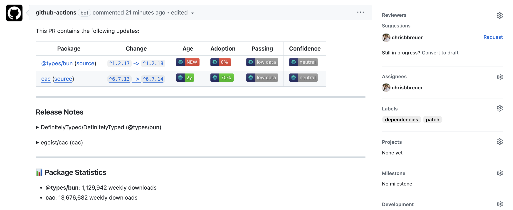

<p align="center"></p>

[![npm version][npm-version-src]][npm-version-href]
[![GitHub Actions][github-actions-src]][github-actions-href]
[](http://commitizen.github.io/cz-cli/)
<!-- [![npm downloads][npm-downloads-src]][npm-downloads-href] -->
<!-- [![Codecov][codecov-src]][codecov-href] -->

# 🐶 Buddy Bot

> Automated dependency updates for the JavaScript and TypeScript ecosystem.

A modern, fast alternative to Dependabot and Renovate built for the JavaScript and TypeScript ecosystem. Buddy automatically scans your projects for outdated dependencies and creates well-formatted pull requests with detailed changelogs and metadata.



## Features

- 🚀 **Lightning Fast**: Built with Bun & performance in mind
- 🎯 **Smart Updates**: Configurable update strategies _(major, minor, patch, all)_
- 📦 **Multi-Package Manager**: Supports Bun, npm, yarn, pnpm, pkgx, and Launchpad dependency files
- 🔍 **Intelligent Scanning**: Uses `bun outdated` for accurate dependency detection
- 📋 **Flexible Grouping**: Group related packages for cleaner PRs
- 🎨 **Rich PR Format**: Detailed changelogs, release notes, and metadata
- ⚙️ **Zero Config**: Works out of the box with sensible defaults
- 🔧 **Highly Configurable**: Customize everything via `buddy-bot.config.ts`

## Quick Start

```bash
# Install globally
bun add -g buddy-bot

# Interactive setup (recommended)
bunx buddy-bot setup

# Or run directly
bunx buddy-bot scan
```

## Usage

### Interactive Setup

The easiest way to get started is with the interactive setup command:

```bash
buddy-bot setup
```

This will guide you through creating GitHub Actions workflows for automated dependency updates. Choose from several presets:

- **Standard Project** - Daily patch updates, weekly minor updates, monthly major updates
- **High Frequency Updates** - Check for updates 4 times per day _(6AM, 12PM, 6PM, 12AM)_
- **Security Focused** - Frequent patch updates with security-first approach
- **Minimal Updates** - Weekly patch updates, monthly minor/major updates
- **Docker Project** - Optimized for containerized applications
- **Monorepo** - Multiple packages in a single repository
- **Development/Testing** - Manual trigger + every 5 minutes _(perfect for testing)_
- **Custom Configuration** - Create your own update schedule

### Command Line Interface

```bash
# Scan for dependency updates
buddy scan

# Scan with verbose output
buddy scan --verbose

# Check specific packages
buddy scan --packages "react,typescript,@types/node"

# Check packages with glob patterns
buddy scan --pattern "@types/*"

# Apply different update strategies
buddy scan --strategy minor
buddy scan --strategy patch

# Update dependencies and create PRs
buddy update --dry-run
buddy update

# Get help
buddy help
```

### Configuration

Create a `buddy-bot.config.ts` file in your project root:

```typescript
import type { BuddyBotConfig } from 'buddy-bot'

const config: BuddyBotConfig = {
  verbose: false,

  // Repository settings for PR creation
  repository: {
    provider: 'github',
    owner: 'your-org',
    name: 'your-repo',
    token: process.env.GITHUB_TOKEN,
    baseBranch: 'main'
  },

  // Package update configuration
  packages: {
    strategy: 'all', // 'major' | 'minor' | 'patch' | 'all'
    ignore: [
      'legacy-package',
      '@types/node' // Example ignores
    ],
    groups: [
      {
        name: 'TypeScript Types',
        patterns: ['@types/*'],
        strategy: 'minor'
      },
      {
        name: 'ESLint Ecosystem',
        patterns: ['eslint*', '@typescript-eslint/*'],
        strategy: 'patch'
      }
    ]
  },

  // Pull request settings
  pullRequest: {
    titleFormat: 'chore(deps): {title}',
    commitMessageFormat: 'chore(deps): {message}',
    reviewers: ['maintainer1', 'maintainer2'],
    labels: ['dependencies', 'automated'],
    autoMerge: {
      enabled: true,
      strategy: 'squash', // 'merge', 'squash', or 'rebase'
      conditions: ['patch-only'] // Only auto-merge patch updates
    }
  }
}

export default config
```

### Programmatic Usage

```typescript
import { Buddy, ConfigManager } from 'buddy-bot'

// Load configuration
const config = await ConfigManager.loadConfig()

// Create Buddy instance
const buddy = new Buddy(config)

// Scan for updates
const scanResult = await buddy.scanForUpdates()

console.log(`Found ${scanResult.updates.length} updates`)

// Check specific packages
const updates = await buddy.checkPackages(['react', 'typescript'])

// Create pull requests
if (scanResult.updates.length > 0) {
  await buddy.createPullRequests(scanResult)
}
```

## How It Works

Buddy leverages Bun's built-in capabilities for maximum performance:

1. **Fast Scanning**: Uses `bun outdated` to quickly identify outdated packages
2. **Smart Parsing**: Analyzes `package.json`, lock files, and dependency files across your project
3. **Dependency File Support**: Automatically detects and updates pkgx and Launchpad dependency files
4. **Intelligent Grouping**: Groups related packages to reduce PR noise
5. **Rich Metadata**: Fetches package metadata, release notes, and changelogs
6. **PR Generation**: Creates detailed pull requests with formatted content

### Supported Dependency Files

Buddy automatically detects and updates the following dependency file formats:

- **package.json** - Traditional npm dependencies
- **deps.yaml** / **deps.yml** - Launchpad/pkgx dependency declarations
- **dependencies.yaml** / **dependencies.yml** - Alternative dependency file format
- **pkgx.yaml** / **pkgx.yml** - pkgx-specific dependency files
- **.deps.yaml** / **.deps.yml** - Hidden dependency configuration files

All dependency files are parsed using the `ts-pkgx` library to ensure compatibility with the pkgx registry ecosystem while maintaining support for tools like Launchpad that reuse the same registry format.

## Update Strategies

- **`all`**: Update all dependencies regardless of semver impact
- **`major`**: Only major version updates
- **`minor`**: Major and minor updates (no patch-only)
- **`patch`**: All updates (major, minor, and patch)

## Auto-Merge Configuration

Buddy supports configurable auto-merge for pull requests to reduce manual overhead:

```typescript
const config: BuddyBotConfig = {
  pullRequest: {
    autoMerge: {
      enabled: true,
      strategy: 'squash', // 'merge', 'squash', or 'rebase'
      conditions: ['patch-only'] // Optional: restrict to specific update types
    }
  }
}
```

### Auto-Merge Strategies

- **`squash`**: Squash commits and merge _(recommended for clean history)_
- **`merge`**: Create a merge commit _(preserves individual commits)_
- **`rebase`**: Rebase and merge _(linear history without merge commits)_

### Auto-Merge Conditions

- **`patch-only`**: Only auto-merge patch version updates _(safest)_
- **No conditions**: Auto-merge all updates _(use with caution)_

### Workflow-Specific Auto-Merge

Each preset configures auto-merge appropriately:

- **High Frequency Updates**: Auto-merge patch updates only _(6AM, 12PM, 6PM)_, manual review for minor updates _(12AM)_
- **Security Focused**: Auto-merge security patches every 6 hours
- **Standard Project**: Auto-merge daily patches, manual review for weekly/monthly updates
- **Development/Testing**: No auto-merge, dry-run by default, enhanced testing features.

## Development & Testing

The **Development/Testing** preset is specifically designed for testing and development environments:

### Features
- **⏰ Every 5 minutes**: Automated runs for rapid testing cycles
- **🖱️ Manual triggers**: Full control via GitHub Actions UI
- **🔍 Dry run by default**: Safe testing without making changes
- **📝 Verbose logging**: Detailed output for debugging
- **📦 Package-specific testing**: Test updates for specific packages
- **📊 Enhanced summaries**: Detailed test reports with context

### Manual Trigger Options
When running manually, you can customize:
- **Update strategy**: Choose patch, minor, major, or all updates
- **Dry run mode**: Preview changes without applying them
- **Specific packages**: Test updates for particular packages only
- **Verbose logging**: Control output detail level

### Perfect For
- 🧪 Testing new configurations
- 🔧 Debugging dependency issues
- 📈 Monitoring update frequency
- 🚀 Validating workflow changes
- 📋 Learning how Buddy Bot works

## Package Grouping

Group related packages to create cleaner, more focused pull requests:

```typescript
{
  groups: [
    {
      name: 'React Ecosystem',
      patterns: ['react*', '@types/react*'],
      strategy: 'minor'
    },
    {
      name: 'Development Tools',
      patterns: ['eslint*', 'prettier*', '@typescript-eslint/*'],
      strategy: 'patch'
    }
  ]
}
```

## Example Output

When Buddy finds updates, it creates PRs like:

```
chore(deps): update all non-major dependencies

This PR contains the following updates:

| Package | Change | Age | Adoption | Passing | Confidence |
|---|---|---|---|---|---|
| [typescript](https://www.typescriptlang.org/) | `^5.8.2` -> `^5.8.3` | [](https://docs.renovatebot.com/merge-confidence/) | [](https://docs.renovatebot.com/merge-confidence/) | [](https://docs.renovatebot.com/merge-confidence/) | [](https://docs.renovatebot.com/merge-confidence/) |

---

### Release Notes

<details>
<summary>microsoft/TypeScript (typescript)</summary>

### [`v5.8.3`](https://github.com/microsoft/TypeScript/releases/tag/v5.8.3)

[Compare Source](https://github.com/microsoft/TypeScript/compare/v5.8.2...v5.8.3)

##### Bug Fixes
- Fix issue with module resolution
- Improve error messages

</details>

---

### Configuration

📅 **Schedule**: Branch creation - At any time (no schedule defined), Automerge - At any time (no schedule defined).

🚦 **Automerge**: Disabled by config. Please merge this manually once you are satisfied.

♻ **Rebasing**: Whenever PR is behind base branch, or you tick the rebase/retry checkbox.

🔕 **Ignore**: Close this PR and you won't be reminded about this update again.

---

 - [ ] <!-- rebase-check -->If you want to rebase/retry this PR, check this box

---

This PR was generated by [Buddy](https://github.com/stacksjs/buddy-bot).
```

## Comparison with Alternatives

| Feature | Buddy | Dependabot | Renovate |
|---------|-------|------------|----------|
| **Speed** | ⚡ Bun-native | 🐌 Slower | 🐌 Slower |
| **Package Managers** | Bun, npm, yarn, pnpm, pkgx, Launchpad | Limited | Limited |
| **Configuration** | TypeScript, YAML, JSON/JS, package.json | YAML | JSON/JS |
| **Grouping** | ✅ Flexible | ✅ Basic | ✅ Advanced |
| **Zero Config** | ✅ Yes | ✅ Yes | ❌ Complex |
| **Self-hosted** | ✅ Yes | ❌ GitHub only | ✅ Yes |

## CI/CD Integration

### GitHub Actions

Buddy includes powerful GitHub Actions workflow templates for different automation strategies:

```yaml
# Basic daily patch updates
name: Daily Dependency Updates
on:
  schedule:
    - cron: '0 2 * * *' # 2 AM daily
jobs:
  update-deps:
    runs-on: ubuntu-latest
    steps:
      - uses: actions/checkout@v4
      - uses: oven-sh/setup-bun@v2
      - run: bun install
      - run: bunx buddy-bot update --strategy patch --verbose
        env:
          GITHUB_TOKEN: ${{ secrets.GITHUB_TOKEN }}
```

**🚀 Generate Advanced Workflows:**

```bash
# Generate comprehensive GitHub Actions workflows
buddy generate-workflows

# This creates:
# - buddy-comprehensive.yml (multi-strategy scheduling)
# - dependency-updates-daily.yml (patch updates)
# - dependency-updates-weekly.yml (minor updates)
# - dependency-updates-monthly.yml (major updates)
# - buddy-monorepo.yml (monorepo support)
# - buddy-docker.yml (Docker-based)
```

**🔥 Comprehensive Multi-Strategy Workflow:**

The comprehensive workflow automatically:
- **Daily 2 AM**: Patch updates (auto-mergeable)
- **Mon/Thu 2 AM**: Minor updates (review required)
- **1st of month 2 AM**: Major updates (review required)
- **Manual trigger**: Any strategy with dry-run option
- **Failure handling**: Auto-creates GitHub issues
- **Smart summaries**: Rich GitHub Actions summaries

### GitHub Actions Permissions Setup

⚠️ **Important**: For Buddy to create pull requests in GitHub Actions workflows, you need to enable the proper permissions:

#### Repository Settings
1. Go to your repository **Settings** → **Actions** → **General**
2. Under **"Workflow permissions"**, select **"Read and write permissions"**
3. ✅ Check **"Allow GitHub Actions to create and approve pull requests"**
4. Click **"Save"**

#### Organization Settings (if applicable)
If your repository is part of an organization, you may also need to enable organization-level permissions:
1. Go to your organization **Settings** → **Actions** → **General**
2. Configure the same permissions as above

#### Quick Setup Command
```bash
# Open GitHub settings pages directly
buddy open-settings

# Or manually visit:
# Repository: https://github.com/YOUR_ORG/YOUR_REPO/settings/actions
# Organization: https://github.com/organizations/YOUR_ORG/settings/actions
```

#### Troubleshooting
If you see errors like:
- `GitHub Actions is not permitted to create or approve pull requests`
- `GraphQL: GitHub Actions is not permitted to create or approve pull requests (createPullRequest)`

This indicates the permissions above need to be enabled. Both GitHub CLI and REST API methods require these permissions to create PRs from workflows.

For more details, see the [GitHub documentation on managing GitHub Actions settings](https://docs.github.com/en/repositories/managing-your-repositorys-settings-and-features/enabling-features-for-your-repository/managing-github-actions-settings-for-a-repository#preventing-github-actions-from-creating-or-approving-pull-requests).

## Testing

```bash
bun test
```

## Build From Source

```bash
bun run build
```

## Changelog

Please see our [releases](https://github.com/stacksjs/stacks/releases) page for more information on what has changed recently.

## Contributing

Please see the [Contributing Guide](https://github.com/stacksjs/contributing) for details.

## Community

For help, discussion about best practices, or any other conversation that would benefit from being searchable:

[Discussions on GitHub](https://github.com/stacksjs/stacks/discussions)

For casual chit-chat with others using this package:

[Join the Stacks Discord Server](https://discord.gg/stacksjs)

## Postcardware

“Software that is free, but hopes for a postcard.” We love receiving postcards from around the world showing where Stacks is being used! We showcase them on our website too.

Our address: Stacks.js, 12665 Village Ln #2306, Playa Vista, CA 90094, United States 🌎

## Sponsors

We would like to extend our thanks to the following sponsors for funding Stacks development. If you are interested in becoming a sponsor, please reach out to us.

- [JetBrains](https://www.jetbrains.com/)
- [The Solana Foundation](https://solana.com/)

## Credits

- [Renovatebot](https://renovatebot.com/)
- [Dependabot](https://dependabot.com/)
- [Chris Breuer](https://github.com/chrisbbreuer)
- [All Contributors](../../contributors)

And a special thanks to [Dan Scanlon](https://twitter.com/danscan) for donating the `stacks` name on npm ✨

## License

The MIT License (MIT). Please see [LICENSE](LICENSE.md) for more information.

Made with 💙

<!-- Badges -->
[npm-version-src]: https://img.shields.io/npm/v/buddy-bot?style=flat-square
[npm-version-href]: https://npmjs.com/package/buddy-bot
[github-actions-src]: https://img.shields.io/github/actions/workflow/status/stacksjs/buddy/ci.yml?style=flat-square&branch=main
[github-actions-href]: https://github.com/stacksjs/buddy/actions?query=workflow%3Aci

<!-- [codecov-src]: https://img.shields.io/codecov/c/gh/stacksjs/buddy/main?style=flat-square
[codecov-href]: https://codecov.io/gh/stacksjs/buddy -->
